**Technical workshop**

Abstract and learning objectives
================================

At the end of this workshop you will have a good understanding of the
kind of information that can be extracted from video and audio content,
you will be more prepared to identify opportunities related to content
intelligence, pitch video AI on Azure, and demo several scenarios on
Video Indexer.

This workshop will go over:

-   Getting started with the Video Indexer

-   Searching for video insights within a catalog

-   Reviewing video insights on a specific video

-   Uploading and Indexing a new video

-   Embedding a video insights widget

-   Editing a video to identify highlights

-   Getting started with Video Indexer API

There is much more you can do with VideoIndxer and that is not included
in this workshop, including customizing the catalog vocabulary, brands
and faces, updating the video transcript, integration with Flow and
connecting to an Azure subscription.

Requirements
============

1.  Internet connection

2.  Internet browser

3.  User account (preferably corporate)

Overview. What is video AI?
===========================

What is Video Indexer?
----------------------

Video Indexer (VI) is a key platform element of the Azure video AI and
media stories. VI accelerates the creation of solutions that take
advantage of video AI by using **deep-learning technology to extract
advanced insights from video and audio files**: spoken words, faces,
celebrity and custom face identification, objects, sentiments, brands
and more.

VI includes a **REST API** that developer can use to build custom
solutions, as well as **widgets** that can be directly embedded into
customer applications, and a **web-based experience** that can be used
to explore the possibilities of the service as well as be used as a
management tool to customize it and connect it to Azure account.

What is the opportunity for the customer (use cases)?
-----------------------------------------------------

Video Indexer delivers a content intelligence report that customers can
use immediately to enhance existing experiences - like improving
experiences related to search or accessibility, however, this new
dimension on the knowledge available to the customers will also enable
them to unlock new innovations both in the user experience and business
models. Here you have several use cases of existing customers using
Video Indexer

-   **Search** -- Insights extracted from the video can be used to
    enhance the search experience across a video library. For example,
    indexing spoken words and faces can enable the search experience of
    finding moments in a video where a person spoke certain words or
    when two people were seen together. Search based on such insights
    from videos is applicable to news agencies, educational institutes,
    broadcasters, entertainment content owners, enterprise LOB apps and
    in general to any industry that has a video library that users need
    to search against.

-   **Monetization** -- Video Indexer can help improve the value of
    videos. As an example, industries that rely on ad revenue (e.g. news
    media, social media, etc.), can deliver more relevant ads by using
    the extracted insights as additional signals to the ad server
    (presenting a sports shoe ad is more relevant in the middle of a
    football match vs. a swimming competition).

-   **User engagement** -- Video insights can be used to improve user
    engagement by positioning the relevant video moments to users. As an
    example, consider an educational video that explains spheres for the
    first 30 minutes and pyramids in the next 30 minutes. A student
    reading about pyramids would benefit more if the video is positioned
    starting from the 30-minute marker.

-   **Accessibility** - Video Indexer extracts metadata such as the
    spoken words, the people present in a video segment, the text that
    is part of the video and so on. This metadata can be used to make
    content accessible to people with visual and audio disabilities. For
    example, the player widget provided by Video Indexer has built in
    closed captioning support and the insights widget can translate the
    transcript in to other languages

-   **Content moderation** - Video Indexer can identify potentially
    offensive textual and visual content and so can be used for content
    moderation

Exercise 1: Login to video indexer
==================================

*Duration: 2 minutes (easy!)*

Context
-------

-   You can start using Video Indexer with a click of a button

-   Video Indexer provides a free usage threshold that allows you to
    evaluate (or demo) the scenario and include all the functionality of
    the paid solution.

-   If anybody wants to go over the amount of resources offered on the
    free threshold, they can directly connect the Video Indexer
    experience with an Azure account.

-   You can login to Video Indexer with a variety of accounts:
    corporate, Outlook, Gmail, LinkedIn, or Facebook

Steps 
------

1.  Go to <https://www.videoindexer.ai/>

2.  Click "Sign in" in the top right corner

    {width="0.90625in" height="0.53125in"}
        
3.  Use your login option of choice

> 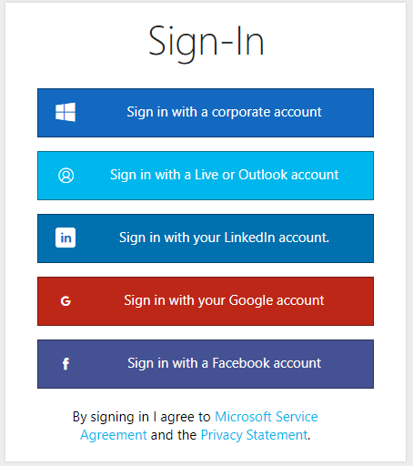{width="2.613973097112861in"
> height="2.9479166666666665in"}

4.  **Welcome!** You now have access to the Video Indexer web
    experience. After logging in you will be dropped into the Video
    Gallery where you can see all your uploaded videos as well as sample
    videos. From here you can search in all videos, upload new videos,
    see insights for each specific video and more.

    {width="6.037736220472441in"
    height="2.4834700349956256in"}

Exercise 2: Search within existing files
========================================

*Duration: 4 minutes*

Context
-------

-   From the Video Indexer portal, you can search for insights on
    indexed video and audio across your catalog. This includes
    identifying celebrities, detecting keyworks and labels, finding
    brands and much more. Let's start by searching across sample videos
    that were already indexed for you.

Steps
-----

1.  Click on the "Sample Videos" tab to see all sample videos

    {width="2.899806430446194in"
    height="0.5625in"}

2.  On the search bar, search for **Build** in the 'Find Topic' box and
    for **Satya** in the 'Find People
    '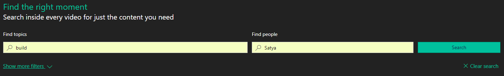{width="5.735849737532808in"
    height="0.8738593613298338in"}

3.  The videos in the gallery will are filtered according to your
    filtering you requested, and each video thumbnail will include a
    summary of the insights found. In this case we can see visual,
    transcript, labels and name insights were found. Later in this
    workshop we will learn more about those insight.

> 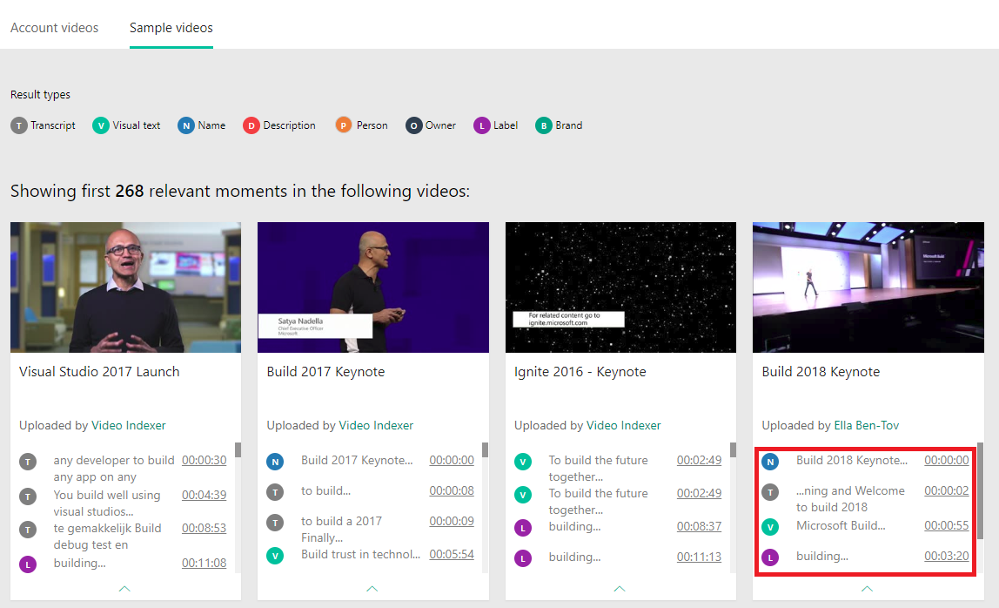{width="5.78301946631671in"
> height="3.469811898512686in"}

4.  Click **show more filters** to see more filtering options such as
    filtering by specific types of insights or specific languages.

5.  Click **Clear search** to start over.

Exercise 3: Review insights in a file
=====================================

*Duration: 10 minutes*

Context
-------

-   For each video you can see the cognitive insights found for the
    video and track them as the video run. This include a broad set of
    insight types, such as people recognition, celebrity identification,
    keywords extraction, label extraction, brand identification,
    sentiment analysis, keyframe analysis and more.

-   **Important**: These features represent only a subset of the
    insights available via the Video Indexer! We will see several
    options for how to get to more insights later in this workshop
    (hint: you can download the JSON file or use the API to get more
    insights)

Steps
-----

(part of this exercise will require you play a video, we recommend using
headphones or mute the sound in your laptop to avoid disturbing other
participants)

1.  In the **Sample videos** tab hover over the video called "*Build
    Keynote 2018*".

2.  Click **Play** to go into the video player page

    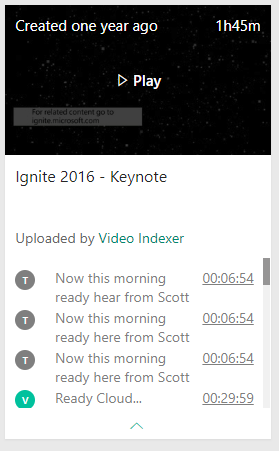{width="2.90625in"
    height="1.641509186351706in"}

3.  In the top of the cognitive insights pane, click on **Transcript**
    to see the video transcript. The transcript includes the voice to
    text identified by Video Indexer as well as OCRs, people found,
    sentiment indications and more.

    {width="2.047169728783902in"
    height="0.48463582677165357in"}

4.  Enable the **Autoscroll** toggle on the right to have the transcript
    scroll as the video progress and the current segment highlighted at
    any time

    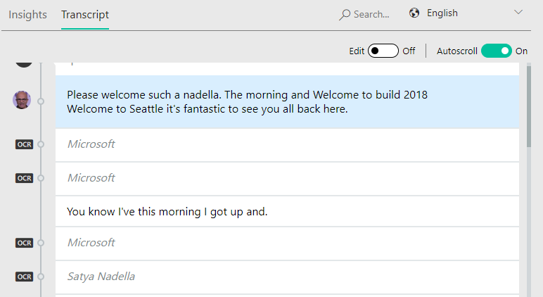{width="5.886792432195976in"
    height="3.217610454943132in"}

5.  Now, let's explore some of the insights found on this specific
    video. Click on the **Insights** tab to go back to insights summary.

> {width="2.23584864391951in"
> height="0.5387587489063868in"}

1.  **Celebrity Identification**: Video Indexer identified Satya in the
    video, you can see his name, role and biography, as well as how much
    time and when he made appearances in the video. Use the left and
    right arrows to jump between segments he appears in

    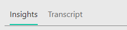{width="4.020833333333333in"
    height="1.6869455380577427in"}

    Video indexer is able identify a large set of celebrities (like
    Satya in this example) out of the box and allows you custom train
    the model with your own celebrities, by tagging additional faces
    identified in your uploaded video.

2.  **Keyword identification**: Video Indexer used the information on
    the transcript -- gathered from the spoken information as well as
    OCR findings in the video, to identify keywords.

    This can help you get the essence of what was discussed in this
    video. In this case we can see that Satya referred to the
    *intelligent edge*, *industrial revolution* and more.

    Use the **show all** to reveal the full set of keywords found and
    the right and left arrows to navigate to the specific location in
    the video where they appeared.

    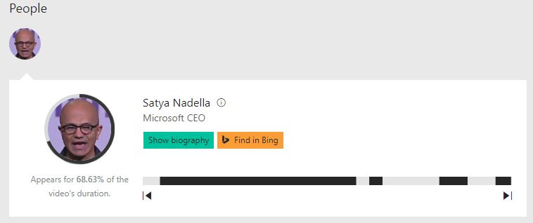{width="5.632075678040245in"
    height="1.453147419072616in"}

3.  **Label identification**: Labels are visual findings in the video,
    they can help you determine elements, scenes, and locations.

    In this case, the labels: "*man", "standing", "indoor*" really
    reflect on what we see in the video. As in Keywords, you can use the
    show more to see the full set of keywords found and to use right and
    left arrows to navigate to the specific location in the video where
    they appeared.

    Note: you can see that some of the labels are less relevant, for
    example 'outdoor', this is the nature of machine learning
    algorithms, it is a prediction tool and, in some cases, may be
    erroneous. However - looking at the labels still gives you a good
    idea for what this video is about.

    {width="5.707547025371828in"
    height="0.8817432195975503in"}

4.  Video Indexer identified two **brands** in this video, that Satya
    mentioned or appeared as OCR in his keynote: "*Microsoft"* and
    "*Apple inc."*. Here is well, use the arrows to jump to the specific
    location in the video where they appeared and to use show
    description to see their Wikipedia abstract.

    {width="5.716981627296588in"
    height="1.6277515310586177in"}

5.  **Sentiment**: Video Indexer has also identified the different
    sentiments that appear through the video, click on each segment to
    see what actually happened in the video to drive that. you can see
    that oveall (insuprosingly) Satya expressed mostly positive
    sentiments in his keynote.

    {width="5.754716754155731in"
    height="1.1927515310586176in"}

<!-- -->

6.  All this information that you can browse on the widgets comes from a
    JSON file that it's what the developer would need to work with if
    they're building a custom solution. Open the JSON file click the
    **{}** button at the bottom left of the video player.

> {width="1.1770942694663167in"
> height="0.447917760279965in"}

As you can see the JSON file has all the information that you have seen
on the widgets, and more, you will be able to explore the JSON file in
more detail in Exercise 8 below.

Exercise 4: Upload and Index your own file
==========================================

*Duration: 5 minutes*

Context
-------

-   Video Indexer allow you to upload your own video and audio files

-   Once a file is uploaded and indexed, it is added to your catalog and
    you can search it and review insights on it, like you did in the
    first step

Steps
-----

1.  Copy this URL to your clipboard <https://aka.ms/VISampleVideo>

2.  Click the **Upload** button on the top right of your catalog (under
    the search section)

    {width="5.773584864391951in"
    height="1.3395833333333333in"}

3.  Select the **enter file URL** link and paste the URL you copied in
    step one

    {width="2.6526148293963256in"
    height="2.1132075678040243in"}

4.  Select a 'video name' of your choice for you video and Click
    **Upload**. The video will start to upload...

    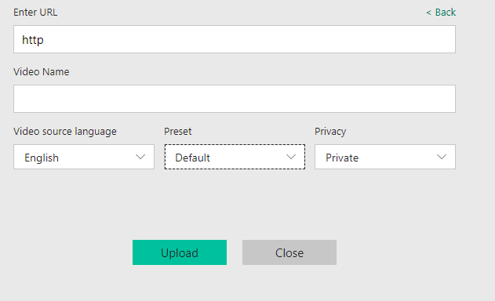{width="4.330670384951881in"
    height="2.6354166666666665in"}

5.  The upload may take a few minutes. You can click **Run in the
    background** to continue browsing your existing videos while the
    video is uploading

6.  Once the video is uploaded it will added to your catalog under the
    **Account videos** tab and start indexing

    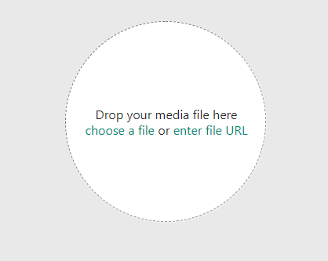{width="2.4242465004374454in"
    height="1.367924321959755in"}

7.  **Done!** You have indexed your fist video, you can now explore the
    insights found for this video in the portal as well as on a JSON
    file that a developer could parse on a custom development.

    Try to explore - what interesting insights you can find in this
    video?

Exercise 5: Embed widgets on your own website
=============================================

*Duration: 4 minutes*

Context
-------

-   Video Indexer allows you to create an interactive widget for the
    insights gathered on your video as well as for the video player
    itself

Steps
-----

1.  Go back to the "*Build Keynote 2018*", you reviewed in exercise \#3

2.  Click on the embed (**\</\>**) icon at the bottom of the video

    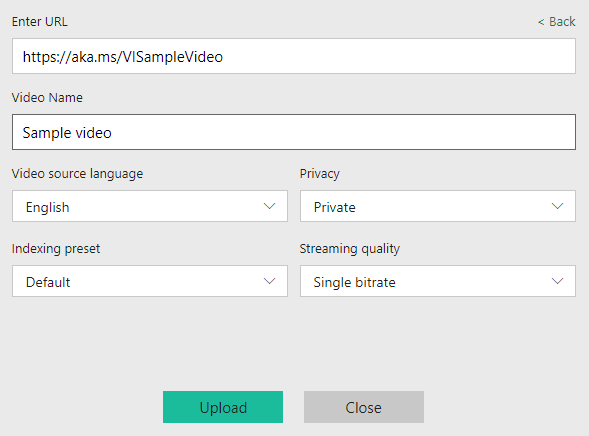{width="4.160377296587926in"
    height="1.2913976377952756in"}

3.  A 'share & embed' pop up appears, allowing to copy the iframe code
    to the web site. From here you can choose to create an embedded code
    for the cognitive insights, the video player or both.

> 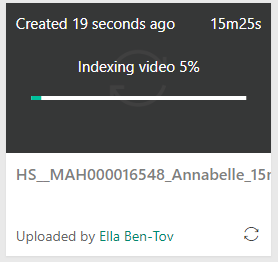{width="5.000575240594926in"
> height="3.4270833333333335in"}

4.  Optional: to test the iframe copy the 'src' part of the 'Copy embed
    code' section into a new tab in your browser

Exercise 6: Edit a file
=======================

*Duration: 5 minutes*

Context
-------

-   Video Indexer also includes a light weight editor, which makes it is
    easy to find highlights in a video

-   You can filter any insights and then select witch sections in the
    transcript to edit in and out of the video and then publish it as a
    new video

Steps
-----

1.  Click **Edit** on the bottom right of the file player you uploaded
    to go to the video editor

    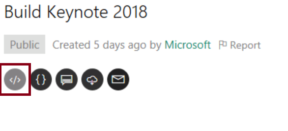{width="3.3489096675415575in"
    height="2.2465594925634296in"}

2.  In the filter pane on the left-hand side, filter for Keywords =
    ***industrial revolution***

    {width="1.5690332458442695in"
    height="3.4245286526684167in"}

3.  In the transcript, hover on Each line and click the **+** action on
    the right to select it

    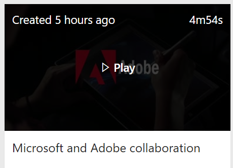{width="5.650943788276465in"
    height="1.0909459755030622in"}

4.  Click on the **Preview** button on the right to see your selection
    result

    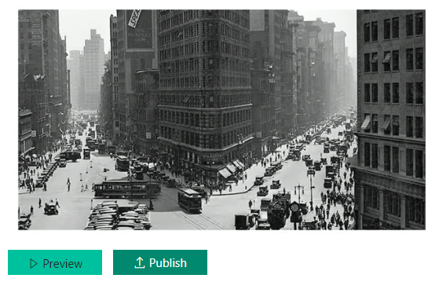{width="5.822915573053368in"
    height="3.7395833333333335in"}

5.  Click on the **Publish** button on the right to save your selection
    as a new video.

    {width="5.822915573053368in"
    height="3.7395833333333335in"}

6.  A new video that contains a clip from the original video was added
    to your catalog and start to play.

Exercise 7: Getting started with Video Indexer REST API
=======================================================

*Duration: 7 minutes*

Context
-------

-   Everything you seen (**and more!**) is available also via the Video
    Indexer REST API

-   Getting started and evaluating the REST API is simple and straight
    forward and does not require any coding skill!

-   The Video Indexer rest API is unique in the industry by the fact
    that it enables you to use it in a client to server architecture (as
    well as server to server)

Steps
-----

1.  Go to the API portal <https://api-portal.videoindexer.ai/>. This
    portal gives you quick and easy access to review and try out the
    Video Indexer APIs available.

2.  You are probably already logged in via SSO but if not, login with
    the same credentials you logged into the service in exercise \#1

    {width="0.9166666666666666in"
    height="0.4583333333333333in"}

3.  Select the **Product**s tab

    {width="3.125in"
    height="0.4270833333333333in"}

4.  Select **Authorization** and subscribe to the
    API{width="5.802083333333333in"
    height="0.7395833333333334in"}I.

5.  Select **Subscribe**

    {width="1.896227034120735in"
    height="1.3694969378827646in"}

6.  Select **Confirm**

    {width="4.197749343832021in"
    height="1.73584864391951in"}

7.  Select the **APIs** tab

    {width="3.1666666666666665in"
    height="0.3645833333333333in"}

8.  Choose **Authorization** to get the token to call the API operations
    with. Note that this token is valid for one hour.

    {width="4.267051618547682in"
    height="0.9433956692913386in"}

9.  Select the **GetAccounts** API call and click **Try It. **

    Clicking try it on any API call in this web site, will allow you to
    try the API call with your own parameters without needing to write
    any code. In this case, we are trying to get the account information
    in order to call other operations.

    {width="6.5in"
    height="1.9659722222222222in"}

10. Fill in the parameters: *location = **trial***,
    *generateAccessToken=**true***, *allowEdit=**true ***to get access
    token to the account you used in this workshop

> {width="4.635416666666667in"
> height="2.0586996937882764in"}

11. Scroll to the bottom of the page and click **Send**

    {width="0.8645833333333334in"
    height="0.4166666666666667in"}

12. In the result you will get your **account id** and **access token**.

    **Important**: Copy the account id and access token or keep the
    result page open as you will need them for later API calls

> {width="6.5in"
> height="2.6979166666666665in"}

Exercise 8: Invoke a sample service
===================================

*Duration: 7 minutes*

Context
-------

-   Now that you are authorized to the API and have your access token
    available, you can try out some of the function

Steps
-----

1.  Go to the **API** tab again and choose **Operations** to review all
    the REST API calls available to you in video indexer.

    {width="6.5in" height="1.59375in"}

    For this workshop, we will use the API to get insights on the same
    video we uploaded in previous exercise

2.  Choose the **ListVideos** API call, click **Try it** and fill in the
    parameters: *location = **trial** and **account id** and **account
    token** from the GetAccountscall* from the previous exercise

    {width="4.386792432195976in"
    height="1.8906321084864393in"}

3.  Scroll to the bottom of the page and click **Send**

4.  Your account first result will include the video that you uploaded.

    **Important**: Copy the video id or keep the result page open as you
    will need them for later API calls

    {width="3.415094050743657in"
    height="0.8572364391951006in"}

5.  Now choose the **GetVideoIndex** call, click **Try it** and fill in
    the parameters: *location = **trial** and* **account id** and
    **account token** from the *GetAccounts* call result, and **video
    Id** from *ListVideos* result from the previous steps.

    {width="5.349056211723535in"
    height="1.8561679790026246in"}

6.  Scroll to the bottom of the page and click **Send**

7.  The result will be in JSON format and includes all the insights
    found on the Video.

    Some insights in this result are not yet available in the Service.
    You can use search for some examples in the response:

    a.  Search for "*visualContentModeration*" and
        "t*extualContentModeration*" to find content moderation insights
        results

        **Content moderations insights** allow you to find and alert on
        inappropriate or offensive content in your videos.

    b.  Search for "*keyFrames*" to find keyFrame results

        **Keyframe insights** allow you to identify still images
        representing scenes in videos, to be later used for thumbnails,
        or clips representing the video

Congratulations!

You successfully completed the Video Indexer workshop!

We hope you have enjoyed this workshop, as you can imagine this is just
the tip of the iceberg, visit **http://video.ai** if you want to
continue learning about Video Indexer and Video AI.
